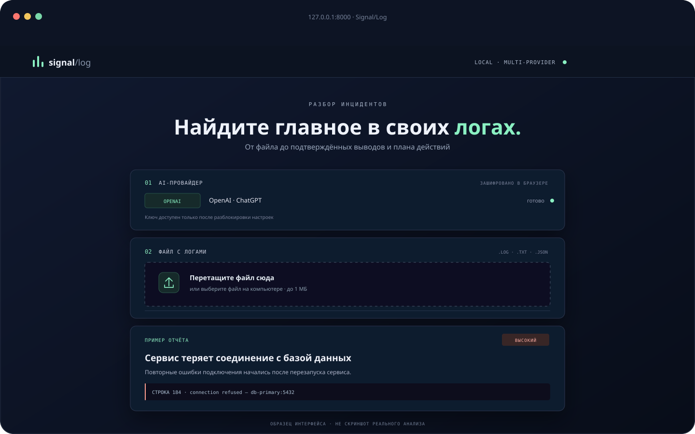
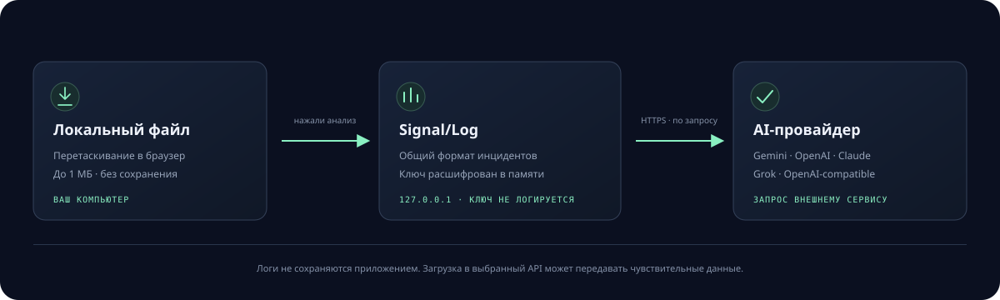

<div align="center">

# Signal/Log

### Turn noisy logs into clear next steps

Drop in a file, choose an AI provider, and get evidence-backed findings, a
timeline, and practical recommendations.


</div>

<p align="center">
  
</p>

<p align="center"><sub>An original project illustration. The report shown is an example, not a response from a live model.</sub></p>

---

## Overview

Signal/Log is a lightweight, local-first tool for an initial review of log
files. Open it in a browser, drop in a `.log`, `.txt`, `.json`, or other UTF-8
text file, and let your chosen model highlight what matters.

The report goes beyond a summary: it includes an overall severity, incidents,
short supporting excerpts with line numbers, a timeline, recommendations, and
caveats. Export the result as JSON to attach it to a ticket or incident.

## Data flow

<p align="center">
  
</p>

The preview and diagram are original SVG illustrations created for this
project.

## Features

- **Multiple providers:** Google Gemini, OpenAI, Anthropic Claude, xAI Grok,
  and other APIs compatible with OpenAI Chat Completions.
- **Custom models and endpoints:** enter the exact model name you want to use;
  compatible APIs also accept a custom Base URL, including local endpoints.
- **Encrypted settings:** API keys and model settings are encrypted in the
  browser with AES-GCM. Set a separate encryption password and unlock your
  settings with it the next time you open the app.
- **Consistent reports:** each provider is normalized to the same structured
  output.
- **No analysis history:** the application does not save uploaded logs or
  reports. Files are limited to 1 MB; requests include up to 80,000 characters,
  retaining the beginning and end of longer logs.
- **Linux CLI:** analyze local files and systemd journals with
  `loganalyzer analyze` and `loganalyzer service`.
- **Local by default:** the server binds to `127.0.0.1`. API keys are not
  written to server settings or included in URLs.

## Supported providers

| Provider | Get an API key | Example model |
|---|---|---|
| Google Gemini | [Google AI Studio](https://aistudio.google.com/app/apikey) | `gemini-2.5-flash` |
| OpenAI · ChatGPT | [OpenAI API keys](https://platform.openai.com/api-keys) | `gpt-4.1-mini` |
| Anthropic · Claude | [Anthropic Console](https://console.anthropic.com/settings/keys) | `claude-haiku-4-5-20251001` |
| xAI · Grok | [xAI Console](https://console.x.ai/) | `grok-4.7` |
| OpenAI-compatible | Your API provider | Enter a model available to your account |

The model names above are starting suggestions. Availability depends on the
provider and your account; use the model ID shown in your provider dashboard.
API requests may incur charges or count toward account limits.

## Run on Windows

Open PowerShell and install the project:

```powershell
Set-Location H:\LogAnalayser
python -m venv .venv
.\.venv\Scripts\python.exe -m pip install .
.\.venv\Scripts\loganalyzer.exe web
```

If `.venv` already exists, you do not need to create it again. Open
<http://127.0.0.1:8000>.

In the browser:

1. Choose Gemini, OpenAI, Claude, Grok, or an OpenAI-compatible API.
2. Enter a model name from your provider's dashboard.
3. Paste an API key issued by that provider.
4. The first time you save settings, choose an encryption password of at least
   12 characters. This is the browser storage password, not your provider
   password.
5. Select **Encrypt and save**, choose a log file, and click **Analyze log**.

On later visits, unlock the settings with the same password. Use the controls
next to the provider name to edit or delete them. If you clear the site's
browser data or forget the password, the saved settings cannot be recovered;
enter the API key again.

To connect an OpenAI-compatible endpoint, select the last provider option.
Enter its Base URL (for example, `http://127.0.0.1:1234/v1`) and the exact
model name served by that endpoint. The endpoint must be reachable from the
computer running Signal/Log. Use HTTPS for remote endpoints; unencrypted HTTP
is accepted only for local or private addresses.

## Run on Ubuntu

Python 3.11 or later is required:

```bash
cd /path/to/LogAnalayser
python3 -m venv .venv
source .venv/bin/activate
python -m pip install .
loganalyzer web
```

Open <http://127.0.0.1:8000> and enter your API key in the web settings. Do
not expose the server to the public internet: the web interface does not have
user authentication.

## CLI on Ubuntu

For CLI use, provide the API key through environment variables, not a command
line argument. Example using Gemini:

```bash
read -rsp "Gemini API key: " AI_API_KEY
echo
export AI_API_KEY
export AI_PROVIDER=gemini
export AI_MODEL=gemini-2.5-flash
loganalyzer analyze /var/log/my-service.log
```

Analyze a systemd service journal:

```bash
loganalyzer service nginx.service --since "2 hours ago" --lines 1500
loganalyzer service my-app.service --since "today" --format json --output report.json
```

Other providers can be selected from the CLI:

```bash
export AI_PROVIDER=openai
export AI_API_KEY
export AI_MODEL=gpt-4.1-mini
loganalyzer service nginx.service --since "1 hour ago"
```

Supported `AI_PROVIDER` values are `gemini`, `openai`, `anthropic`, `xai`, and
`openai-compatible`. For compatible APIs, also set `AI_BASE_URL`, such as
`http://127.0.0.1:1234/v1`. Gemini also accepts `GEMINI_API_KEY` and
`GEMINI_MODEL` for backward compatibility.

## Privacy and API keys

Logs can contain addresses, names, internal hostnames, and tokens. Remove
anything you do not want to disclose before analysis. When you start an
analysis, the log is sent to the **selected AI provider**; using a local
application does not mean that the model processes the log locally. The
application does not save the uploaded file as a project file or report
history. Like other multipart uploads, the file may be buffered temporarily by
the web server while the request is processed.

Provider settings are stored as AES-GCM ciphertext in browser storage. The
encryption password is used with PBKDF2 to derive the encryption key and is
not stored by the application. If an API key has appeared in a public chat,
repository, or screenshot, revoke it in the provider dashboard and create a
replacement.

While settings are unlocked, the key remains temporarily in the browser
tab's memory and is sent to the local server only with an analysis request.
This protection does not cover a compromised computer or malicious browser
extensions. Do not use web mode as a public service.

The provider may process requests under its own terms, account settings, and
data retention policy. Check your organization's rules before submitting
service logs.

## Development and tests

```bash
python -m pip install -e ".[dev]"
pytest
```

Tests use mocked API responses; no provider credentials or network access are
required.
